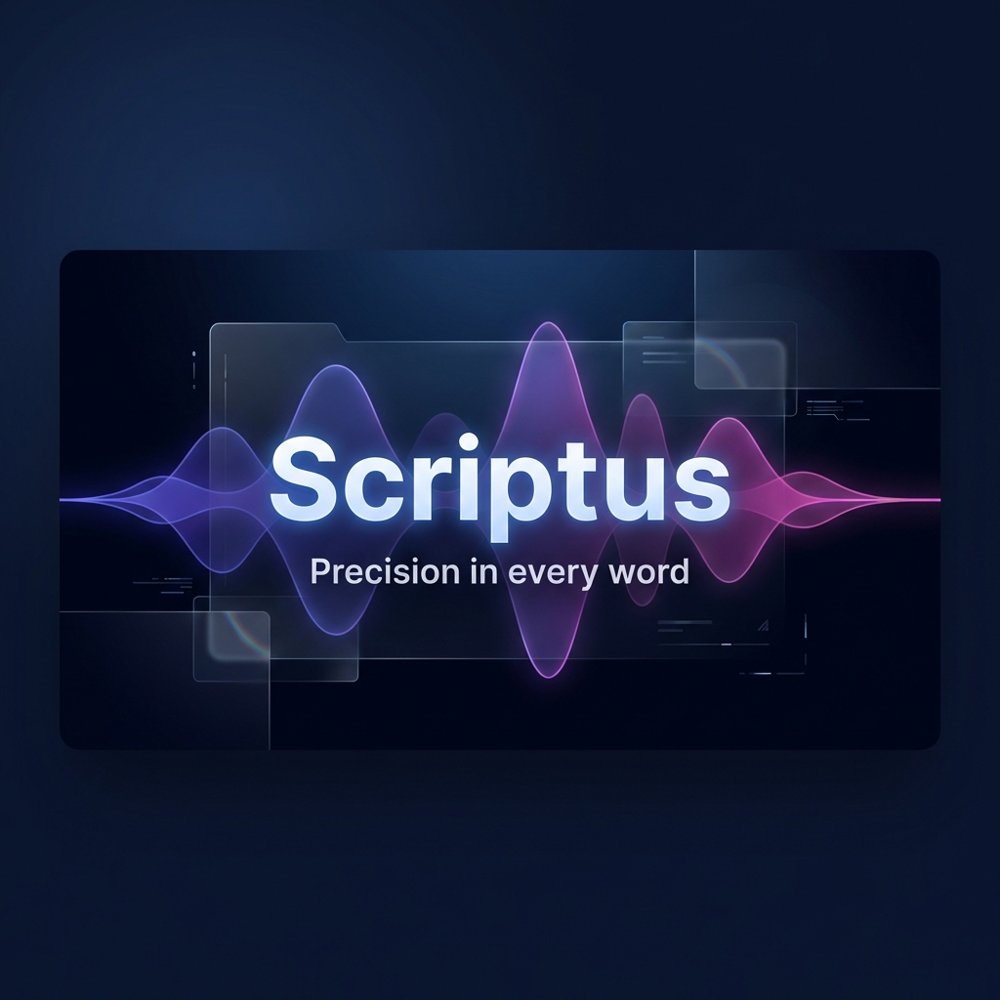

<div align="center">
  <h3>Precision in every word.</h3>
  <p>A premium, AI-powered transcription and translation suite designed for creators, professionals, and teams.</p>
</div>

<div align="center">
  
  
  
  
</div>

---

## 🚀 Welcome to Scriptus

**Scriptus** is a modern, full-featured audio transcription and translation platform. Built on the solid foundation of the open-source project Whishper, Scriptus takes the experience to a new level with a premium user interface, ultra-fast AI inference, and cloud-ready synchronization.

### ✨ Key Features

*   **⚡ Ultra-Fast Transcription**: Support for **Groq API**, enabling hours of audio processing in mere seconds.
*   **🎯 Whisper V3 Turbo**: Human-level accuracy powered by OpenAI's latest Whisper models.
*   **💎 Premium Editor**: A sleek, dark-themed editor with glassmorphism effects, live timestamps, and speaker diarization.
*   **🌐 Global Ready**: Fully internationalized with deep support for **English and Russian (EN/RU)**.
*   **🛡️ Secure & Private**: Integrated with **Supabase** for robust user authentication and secure data management.
*   **📦 Docker Optimized**: Simplified deployment pipeline with optimized multi-stage build processes.
*   **📝 Multi-Format Export**: Export your work to SRT, VTT, PDF, TXT, or JSON with one click.

---

## 🏗️ Evolution from Whishper

Scriptus is a **proudly-forked evolution** of the [Whishper](https://github.com/pluja/whishper) project. We've taken the core local-first philosophy and added:

1.  **Complete UI/UX Overhaul**: A transition from a utilitarian look to a premium, modern design.
2.  **API-Accelerated Backend**: Integration of Groq for users who need industrial-scale speed.
3.  **Modern Database Layer**: Migrated user management and storage to Supabase for better scalability.
4.  **Enhanced i18n**: Deep localization and custom language handling for international markets.

---

## 🛠️ Project Structure

Scriptus is composed of several high-performance services:

*   **Frontend**: Built with **SvelteKit** and **TailwindCSS** for a reactive, lightning-fast UI.
*   **Backend**: A robust **Go-based** API handling tasks, database synchronization, and user sessions.
*   **Transcription API**: A Python service utilizing **Faster-Whisper** and **Groq** for high-efficiency audio processing.
*   **Translation**: Support for **LibreTranslate** for private, local-first translations.

---

## 🚀 Getting Started

To run Scriptus locally using Docker:

```bash
# Clone the repository
git clone https://github.com/SMO-AI/whishper.git scriptus
cd scriptus

# Copy environment example
cp example.env .env

# Start the services
docker compose up -d
```

For detailed deployment instructions, check out our [Deployment Rules](DEPLOYMENT_RULES.md).

---

## 📜 License

Scriptus is licensed under the **GNU Affero General Public License v3.0**. 

This project carries forward the spirit of open-source collaboration. As Scriptus is a fork of **Whishper** (initially developed by [pluja](https://github.com/pluja)), it maintains the original AGPL-3.0 license. All improvements made by the Scriptus team are also licensed under AGPL-3.0.

---

## 🙌 Credits

Scriptus would not be possible without these amazing projects:

- [Whishper](https://github.com/pluja/whishper) (Original Project)
- [Faster Whisper](https://github.com/guillaumekln/faster-whisper) (Transcription Engine)
- [LibreTranslate](https://github.com/LibreTranslate/LibreTranslate) (Translation Engine)
- [Supabase](https://supabase.com) (Database & Auth)
- [Groq](https://groq.com) (LPU Inference)

---

<div align="center">
  <p>Crafted with ❤️ by the SMO-AI Team.</p>
</div>
